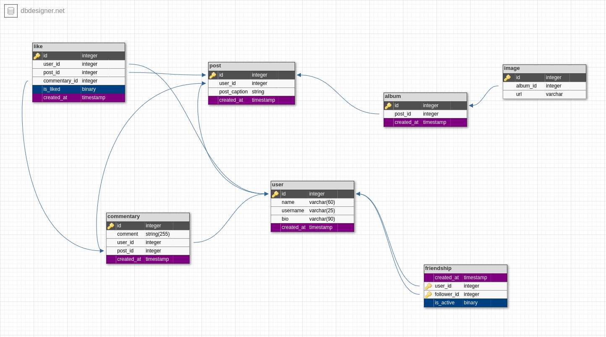

# Desafio Engenheiro de dados

Resolução do desafio técnico para **Engenheiro de Dados** na **Liberfly**

## Parte 1 Modelagem

Modelagem do Banco de Dados Relacional MySQL para aplicativo cópia do instagram.



As tabelas foram criadas com com a intenção de suportar as principais  funcionalidades da plataforma, como:

* Criação de Usuário com Nome, Username (único) e Bio.
* Criação de Post com legenda.
* Adicionar um "album" referenciando o Post criado, o que permitiria adicionar diversas imagens a um único Post.
* Adicionar Images (url) que fazem referência ao album do Post.
* Adicionar Comentários que possuem conteúdo, referenciam o post ao qual eles pertencem e o usuário que os fez.
* Adicionar curtidas a Comentários ou Posts.
* Relações de "Amizade" entre dois usuários.

## Parte 2 Desenvolvimento

Script que busca o nome das cidades contidas no arquivo _ceps.csv_ por cep e salva os resultados no arquivo _NomesCidades.csv_

### Instalando dependências

As dependências devem ser instaladas preferencialmente em um ambiênte virtual.

```bash
virtualenv --system-site-packages -p python3 ceps-venv3
# or
python3 -m ceps-venv3

source ceps-venv3/bin/activate
pip install --upgrade pip
pip install -r requirements.txt
```

### Uso

```bash
python3 main.py # Gera um um arquivo chamado "NomesCidades.csv"
                # na raiz do projeto, contendo o nome das cidades 
                # presentes na lista de CEPs.
# or

python3 run.py [-d] # Path para um CSV com Ceps de cidades .
               [-o] # Nome do CSV de output.
```

### Comentários

Algumas classes não foram escritas da maneira mais otimizada possível, por exemplo, a intenção primária foi atender todos os requisitos do desafio técnico.

Me coloco à disposição para esclarecer qualquer ponto.